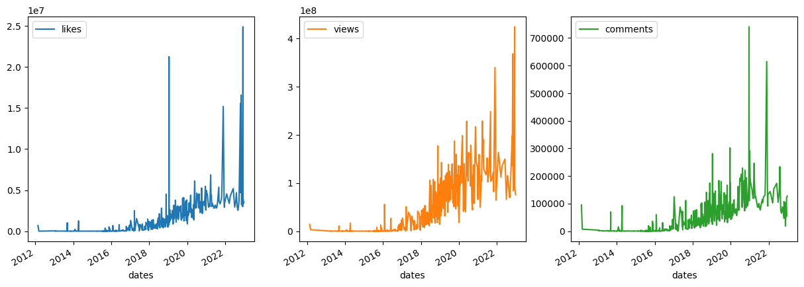
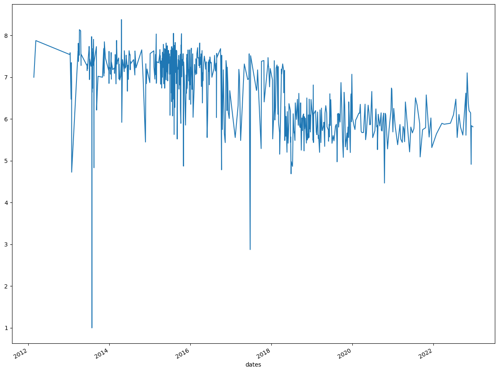

# Youtube Channel Analysis

The notebook is analyzing the channel uploads of Mr.Beast (UUX6OQ3DkcsbYNE6H8uQQuVA)

Mainly 3 API calls are being used to fetch the necessary data (API for reference: https://developers.google.com/youtube/v3/docs): 
1. playlistItems API call:  https://www.googleapis.com/youtube/v3/playlistItems?part=snippet,contentDetails&maxResults=1000&playlistId={}&key={}
- Helps with getting all the videos in the channel. Includes  title, date upload, and video id

2. videos API call: https://www.googleapis.com/youtube/v3/videos?part=statistics&id={}&key={}
- Helps with getting amount of likes/comments/views per video 

3. transcript API call: https://www.youtube.com/youtubei/v1/get_transcript
- Helps with getting the captions for each video 

The below is a monthly timeseries of all the video uploads done. We see an interesting spike of videos in 2015.

The below is a yearly timeseries of all the video uploads. We see much more videos in 2015 than rest of years. 

